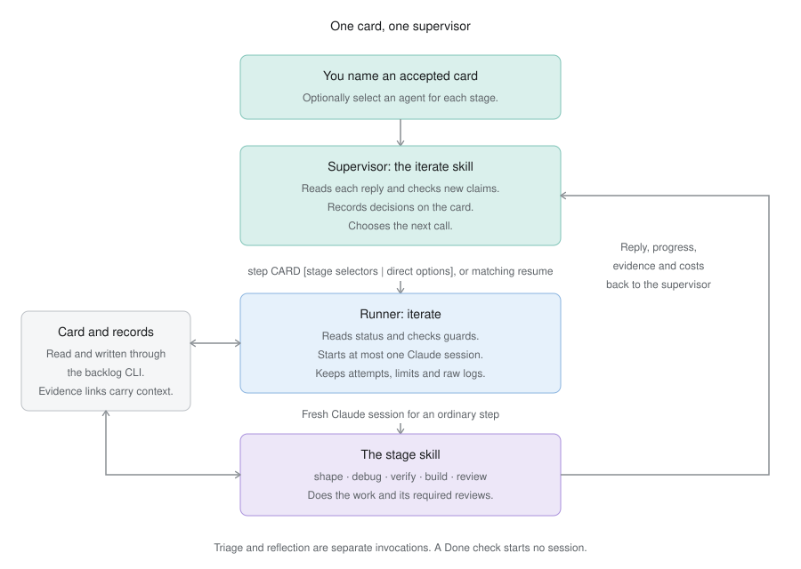
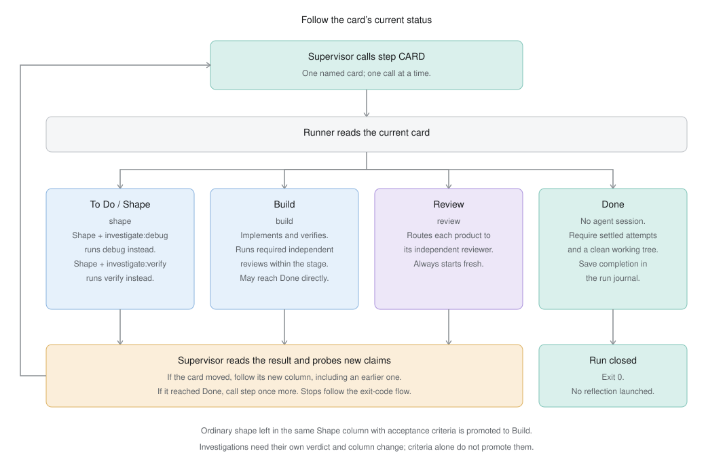
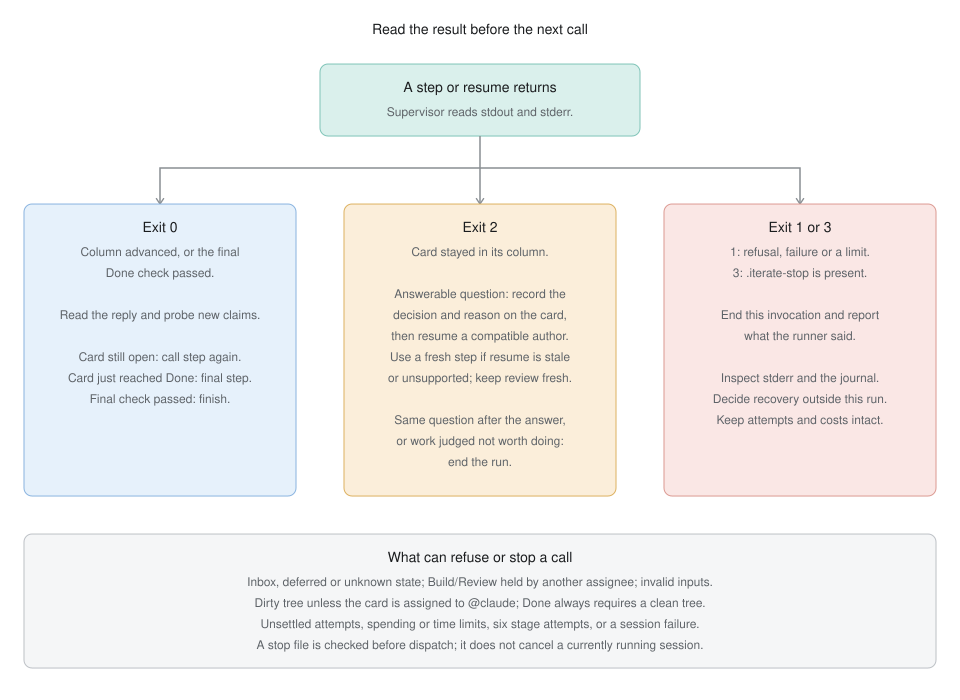

# The iterate workflow

Iterate supervises one accepted card from To Do to Done. Give the `iterate` skill
an explicit card ID in the project's directory:

```text
Use the iterate skill on DOT-123.
/iterate DOT-123 --build-agent claude:sonnet:high
```

Stage selectors let one invocation choose independent agents for shape, debug,
verify, build, and review. Their form is
`--STAGE-agent provider:model[:effort]`. A selector is applied only when its stage
runs, so the example changes Build and leaves every other stage on Claude's CLI
defaults.

The supervising agent runs one stage at a time, reads its result, checks new
consequential claims, and carries the card into the next stage. Each ordinary
stage call starts a fresh Claude session with that stage's skill. The card and its
linked records carry execution details between sessions. Agents also read
`backlog/PRIORITY.md` for the project goal, current focus, and agreed milestone and
card sequence. They update progress as work finishes. New findings remain proposals
until an authorized planning decision changes the sequence.



Triage and reflection are separate skills. Triage screens and orders work before
it is selected. Reflection is a retrospective: it compares a finished or stopped
card's result with the broader goal and proposes planning changes. Choose those
activities when their answers are needed; the card's build and review requirements
still govern delivery.

## Stages



The runner reads the card's current status before each call:

| Card state | Skill |
| --- | --- |
| To Do or Shape | `shape` |
| Shape with `investigate:debug` | `debug` |
| Shape with `investigate:verify` | `verify` |
| Build | `build` |
| Review | `review` |
| Done | Confirm the tree is clean and close the run; no agent session. |

A stage can send the card back to an earlier column. The next call follows that
column. If a normal shape session leaves the card in the same Shape column with
acceptance criteria, the runner promotes it to Build. Investigations require their
own verdict and column change; criteria alone do not promote them. Both
investigation labels on one Shape card cause a refusal.

The stage skills retain their own review requirements. For example, build can
complete its required independent reviews and move the card to Done in that
session. Iterate follows that result without adding another Review session.

## Commands

```sh
iterate step DOT-123
iterate resume DOT-123
iterate status DOT-123
iterate --help
```

`step` runs at most one stage. The supervisor reads its stdout and stderr before
calling it again. A successful step means the card advanced or the Done check
passed; it does not by itself mean the card reached Done.
After a stage reports Done, one final `step` checks the tree and closes the journal
without starting an agent.

The supervisor passes its complete set of `--STAGE-agent` selectors to every
`step` and `resume`. The runner applies only the selector for the current card
stage. Direct runner calls can instead use `--provider claude`, `--model MODEL`,
and `--effort LEVEL` for that one call. The two forms cannot be mixed. `resume`
also requires the immediately preceding author session to have the same stage and
resolved agent options, with a recorded session ID. Use it after resolving a
question that author left open. Review always starts fresh. Ordinary `step` also
starts fresh, including when the card remains in the same stage.

`status [CARD]` reads the durable run journal without starting an agent. Omitting
the ID shows the most recently opened run. Card IDs are case-insensitive.

| Exit | Meaning and response |
| --- | --- |
| 0 | The step advanced, or Done passed its clean-tree check. Read the result before continuing. |
| 1 | The runner refused or failed. Read stderr and the journal before retrying. |
| 2 | The card stayed in its column. Resolve the stage's result before another call. |
| 3 | `.iterate-stop` is present in the current directory. Remove it when work should continue. |



Inbox, unknown columns and cards labeled `deferred` are refused. Build or Review
assigned to someone other than `@claude` is also refused. An iterate invocation
authorizes work on the named card under the existing scope and admission rules.

## Agent, output and limits

Every stage currently uses the `claude` executable. Explicit model and effort
values pass through to Claude. With no selector for a stage, the Claude CLI's
configured defaults apply. The provider field preserves the provider interface,
but another provider is rejected when its selected stage is reached until its
adapter exists. Selection comes from invocation arguments.

Stage replies go to stdout. Stderr carries live progress, tool calls, errors and
paths to retained evidence. `ITERATE_LIVE=0` suppresses live text and tool output;
the final reply and raw Claude logs remain. The supervisor reads both streams
and checks the consequential claims reported by the stage.

Each run allows six stage attempts, including failures, across separate `step`
and `resume` processes. Reopening a completed card starts a new run. Limits belong
to the journal, so restarting the command cannot reset a partially spent run.

| Setting | Limit |
| --- | --- |
| `ITERATE_SESSION_BUDGET` | Claude's dollar cap per session, default `50`. |
| `ITERATE_RUN_BUDGET` | Optional dollar ceiling for the run, fixed when it is created. |
| `ITERATE_RUN_MINUTES` | Optional cumulative stage wall-time ceiling, fixed when the run is created. Time between calls does not count. |

Claude receives the smaller of its session cap and remaining run dollars. If
earlier costs are unknown or cover only the parent agent, a configured run dollar
ceiling blocks another stage. Claude-reported costs are estimates. A session silent
for ten minutes fails; timeouts and cancellation stop its process group with a
one-second grace period.

## Interrupted or unfinished work

A dirty tree normally refuses a run. For a card assigned to `@claude`, the runner
allows continuation and tells the stage to inspect the changes, finish and commit
that card's work, and preserve other changes. This assignee convention is the
runner's ownership check; it does not prove which session wrote each file. Done
requires a clean tree with no ownership exception. An untracked `.iterate-stop`
is excluded from the dirty-tree check.

Run records live under `git rev-parse --git-path iterate`, outside the working
tree. `iterate status CARD` shows the run directory, attempts, requested agents,
raw log and report paths, duration, and known or missing costs. Existing journals
retain earlier intake and reflection records, including their costs and time.

One writer holds a lock in that directory. If a process was killed before it could
release the lock, inspect the recorded PID and children before removing a stale
lock. An attempt with no terminal record blocks further dispatch. Inspect its raw
log and report before repairing the journal, and preserve unknown costs as unknown.
Deleting the journal deletes its enforcement history.

## Installation and checks

Chezmoi installs `dot_agents/workflows/iterate/` to
`~/.agents/workflows/iterate/` and `dot_scripts/executable_iterate` to
`~/.scripts/iterate`. The launcher reconciles pinned Bun dependencies before
running `src/main.ts`. Stage skills install under `~/.agents/skills/`.

Run `bun run check` in the workflow source directory for runner and Claude stream
tests, type checks and lint. These tests use fake Claude and backlog executables
to exercise the runner. They do not establish task quality with real agents.
The [workflow README](../dot_agents/workflows/iterate/README.md) describes the
implementation and retained experiment harness. The [session diagram](iterate-session.svg)
shows how one Claude process runs and reports its result.
