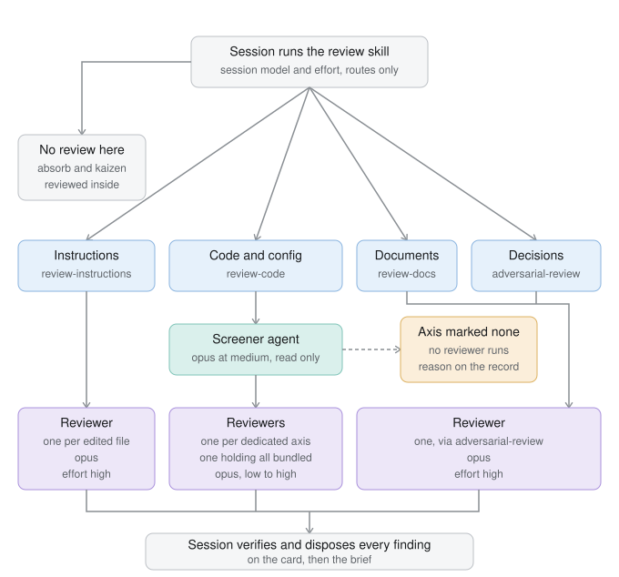

# The review pipeline

For a person deciding whether to change how review works here. Agents do not
read this file: it sits under `docs/`, which `.chezmoiignore` keeps out of
`$HOME`. The rules themselves live in the skills and agent definitions this
describes, and where the two disagree, the skills are what runs.

## What runs

A finished task invokes the `review` skill. That skill routes and reviews
nothing itself: it names each product of the task and sends it to the skill that
owns that kind of product. Instruction files go to `review-instructions`,
documents to `review-docs`, a decision with no document to `adversarial-review`,
and code or configuration to `review-code`. A corpus import and a process defect
are already reviewed inside `absorb` and `kaizen`, so they stop at the router.

Routing mostly reads off the product kind, though one call takes judgment: a
shaped task or a plan reads like instructions and is still a document. The
non-code reviews dispatch far fewer reviewers than the code path, so a screen has
little to save there. The instruction path is the exception worth watching. It
sends every edited file to its own reviewer, so a change touching many instruction
files fans out the same way the code path used to.

`review-code` is where the spending is. It materializes the diff as a patch,
collects the goal, and dispatches a `screener` agent that reads the patch, the
goal, and the code the change reaches. The screener returns one line per review
axis, marked dedicated, bundled, or none, and for each axis that gets a reviewer,
the effort to run it at. `review-code` then spawns one reviewer per
dedicated axis and one reviewer holding all the bundled axes at once.

The six axes are spec conformance, style, architecture, security, testing, and
refactoring. Each has a brief in `references/axes.md` naming the house standard
its reviewer holds beside the diff.

## Why a screener

Before this, `review-code` dispatched a reviewer per axis on every change: five
always, and a sixth for testing when the diff touched a test file. Over the two
weeks ending 2026-09-14, sub-agents accounted for 22 percent of weighted token
spend on this machine, and reviewers were most of that. The figure comes from the
session transcripts under `~/.claude/projects`, weighting cache reads and writes
and output by their API price ratios. It is a measurement of one machine over one
fortnight, not a general result.

A size threshold would have been the obvious control and it is the wrong one: a
three-line change to an authorization check or a migration deserves every axis,
and three hundred lines of generated code deserves none. So the screener judges
by what a change can reach rather than how large it is. It reads the callers, the
data the change writes, the input it accepts, and the configuration that turns it
on, then says for each axis what that axis has to hold against this change.

The screener runs on a strong model at low effort. The judgment needs a model
that can read code well; it does not need a long deliberation.

## The floor

The screener's verdict is a floor. The session running `review-code` may raise an
axis or an effort by naming what the screener did not read or could not
know. It may never lower one.

That asymmetry is the safety property of the whole design. The session that wrote
the change is the one reader who cannot see what it stopped seeing, so letting it
talk itself out of a review would reintroduce exactly the blindness the unprimed
reviewer exists to correct. An axis the screener marks none is recorded with the
screener's reason, so a bad screening rule is findable later rather than silent.

One thing outranks the floor: a direction naming a single axis. Asked for a
security review, the session runs a security review.

## Model and effort

Every reviewer definition pins `model: opus`, and `review-code` passes no model
on the spawn call, because a model on the call overrides the pin. Effort appears
to be settable only in an agent definition's frontmatter, which is why three
reviewer definitions exist,
`reviewer`, `reviewer-medium`, and `reviewer-low`, identical but for their effort.
That constraint was read from the harness documentation and never probed directly;
`references/external-facts.md` in the review-instructions skill records it with
the same caveat. If a later release accepts effort on the spawn call, the two
lighter definitions become unnecessary and should go. The two lighter ones are two
sentences each that point at `reviewer.md`, so the brief has one copy. Their
frontmatter is duplicated and can drift.

Effort follows how far the reviewer has to read: low when the axis has one thing
in front of it, medium when it has to relate the changed files to each other, and
high when it has to trace callers or history. A bundled reviewer takes the highest
effort among its axes.

## What to check

A session that edits an agent definition keeps that definition's first-loaded text
for the rest of the session, so a session changing the pipeline cannot observe its
own change. Verifying any edit here takes a fresh session.

Two things are worth checking on a run: that the screener's verdict carries an
effort for every axis it keeps, and that an axis it marked none or
bundled did not turn out to hold a blocking finding. If the screener marks nearly
everything dedicated, it is saving nothing, and its effort should go up before
anything else changes.

The pipeline described here was committed on 2026-09-14 and had not yet run end to
end at that point.
